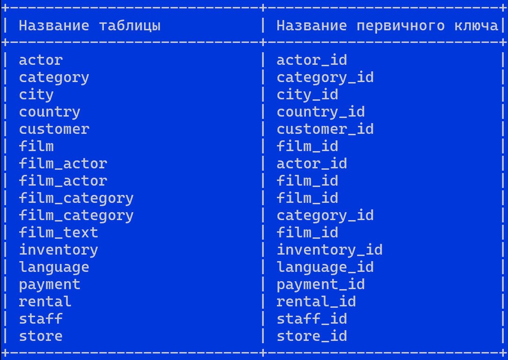

# Домашнее задание к занятию "`Работа с данными (DDL/DML)`" - `Поздникин Е.Н.`


### Инструкция по выполнению домашнего задания

   1. Сделайте `fork` данного репозитория к себе в Github и переименуйте его по названию или номеру занятия, например, https://github.com/имя-вашего-репозитория/git-hw или  https://github.com/имя-вашего-репозитория/7-1-ansible-hw).
   2. Выполните клонирование данного репозитория к себе на ПК с помощью команды `git clone`.
   3. Выполните домашнее задание и заполните у себя локально этот файл README.md:
      - впишите вверху название занятия и вашу фамилию и имя
      - в каждом задании добавьте решение в требуемом виде (текст/код/скриншоты/ссылка)
      - для корректного добавления скриншотов воспользуйтесь [инструкцией "Как вставить скриншот в шаблон с решением](https://github.com/netology-code/sys-pattern-homework/blob/main/screen-instruction.md)
      - при оформлении используйте возможности языка разметки md (коротко об этом можно посмотреть в [инструкции  по MarkDown](https://github.com/netology-code/sys-pattern-homework/blob/main/md-instruction.md))
   4. После завершения работы над домашним заданием сделайте коммит (`git commit -m "comment"`) и отправьте его на Github (`git push origin`);
   5. В личном кабинете прикрепите и отправьте ссылку на решение в виде md-файла в вашем Github.
   6. Любые вопросы по выполнению заданий спрашивайте в разделе “Вопросы по заданию” в личном кабинете.
   
Желаем успехов в выполнении домашнего задания!
   
### Дополнительные материалы, которые могут быть полезны для выполнения задания

1. [Руководство по оформлению Markdown файлов](https://gist.github.com/Jekins/2bf2d0638163f1294637#Code)

---

### Задание 1
Запрос на получение списка пользователей


Запрос на получение списка прав для пользователя sys_temp.


Получения всех таблиц базы данных


Все запросы
```
mysql -u root
CREATE USER 'sys_temp'@'localhost' IDENTIFIED BY 'password';
SELECT User FROM mysql.user;

GRANT ALL PRIVILEGES ON *.* TO 'sys_temp'@'localhost' WITH GRANT OPTION;
FLUSH PRIVILEGES;
SHOW GRANTS FOR 'sys_temp'@'localhost';
quit;

mysql -u sys_temp -p
ALTER USER 'sys_temp'@'localhost' IDENTIFIED WITH mysql_native_password BY 'password';
CREATE DATABASE IF NOT EXISTS sakila CHARACTER SET utf8mb4 COLLATE utf8mb4_unicode_ci;
quit;

mysql -u sys_temp -p sakila < sakila-schema.sql
mysql -u sys_temp -p sakila < sakila-data.sql
mysql -u sys_temp -p -D sakila -e "SHOW TABLES;"
```
---


### Задание 2
Названия таблиц/первичных ключей


---
